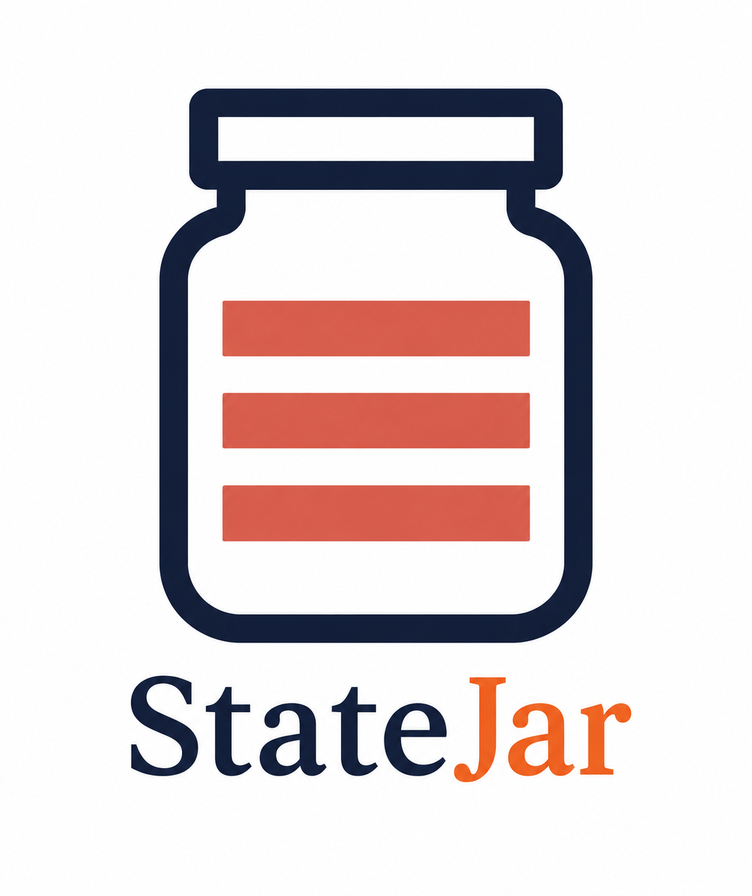
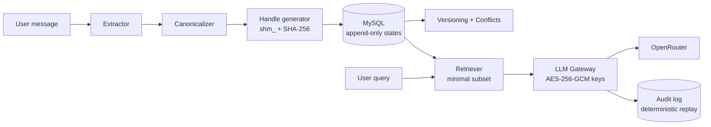
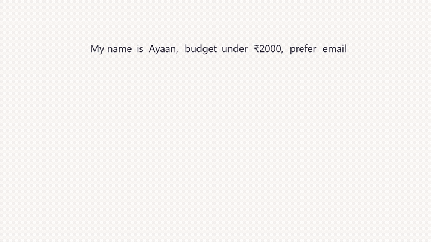
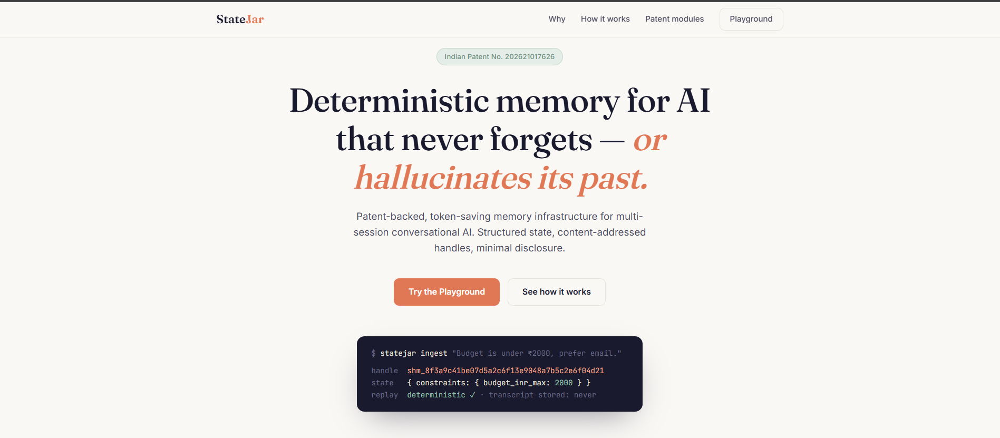
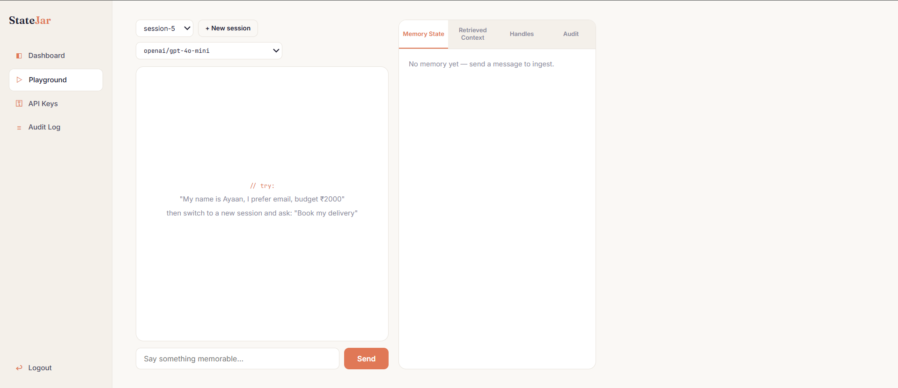
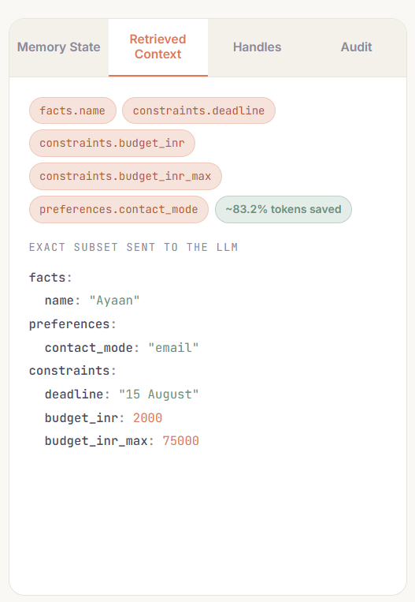
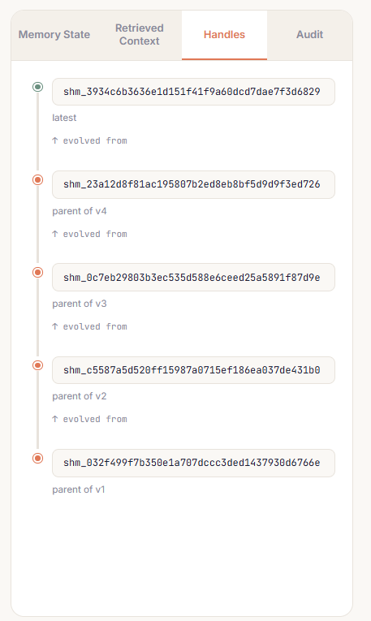
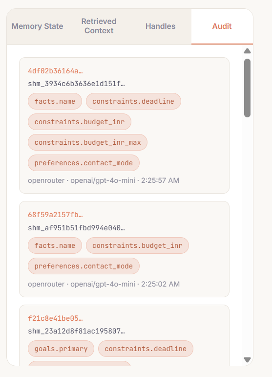
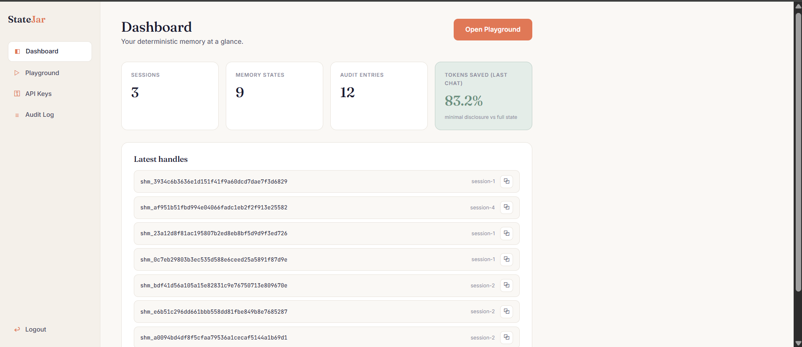

<p align="center"></p>

<h1 align="center">StateJar</h1>

<p align="center"><i>Deterministic, minimal-disclosure memory for multi-session conversational AI.<br>No transcripts. No drift. No token burn.</i></p>

<p align="center">
  
  
  
  
  
  
</p>

<p align="center">
  <b><a href="https://statejar.com">Live Demo</a></b> ·
  <a href="#-architecture">Architecture</a> ·
  <a href="#-the-10-patent-modules">Modules</a> ·
  <a href="#-local-setup">Setup</a> ·
  <a href="#-roadmap-round-2">Roadmap</a>
</p>

<p align="center">🏆 <b>Team Hello World</b> · Hack4Humanity 2026 · AI for Societal Good</p>

<p align="center"></p>

<table align="center">
  <tr>
    <td align="center"><b>~78%</b><br><sub>tokens saved</sub></td>
    <td align="center"><b>10</b><br><sub>patent modules</sub></td>
    <td align="center"><b>65</b><br><sub>tests passing</sub></td>
    <td align="center"><b>SHA-256</b><br><sub>deterministic</sub></td>
  </tr>
</table>

> 🎯 **TL;DR** — StateJar turns conversations into hash-addressed structured state, so any LLM recalls exactly the facts it needs: ~78% fewer tokens, zero transcripts, fully auditable.

<table>
  <tr>
    <td align="center" width="25%"><b>1 · Extract</b><br><sub>Structured facts from conversation</sub></td>
    <td align="center" width="25%"><b>2 · Canonicalize</b><br><sub>One deterministic JSON form</sub></td>
    <td align="center" width="25%"><b>3 · Handle</b><br><sub>SHA-256 → <code>shm_…</code> address</sub></td>
    <td align="center" width="25%"><b>4 · Retrieve Minimum</b><br><sub>Only the fields needed</sub></td>
  </tr>
</table>

<br>

---

## 🧩 The Problem

- **Context drift** — every new chat session forgets who you are; assistants re-ask what they already knew.
- **Token burn** — the standard fix is replaying entire chat histories to the LLM, paying for thousands of irrelevant tokens per request.
- **Hallucinated memory** — fuzzy vector "memories" retrieve approximately-similar text, not the actual facts, and can't prove what the model was told.

## 💡 The Solution

StateJar replaces transcript replay with **content-addressed structured state**:

1. **Extract** — pull structured facts/preferences/constraints from conversation text (rule-based, GLiNER2-ready).
2. **Canonicalize** — normalize to deterministic canonical JSON (₹2,000 ≡ 2000, key order irrelevant, dates → ISO).
3. **Handle** — SHA-256 the canonical form → `shm_…` handle. *Same meaning ⇒ byte-identical handle, every time.*
4. **Retrieve Minimum** — for each query, send the LLM **only the fields it needs**, with a full audit trail proving exactly what was disclosed.

Memory evolves append-only: updates create new handles linked by `parent_handle`; old states are never modified, and conflicting facts are preserved as explicit conflict records instead of silently overwritten.

<br>

---

## 🧬 Architecture



<br>

---

## 📦 The 10 Patent Modules

| # | Module | File | What it does |
|---|--------|------|--------------|
| 1 | State Extraction | `backend/app/memory/extractor.py` | Text → structured state |
| 2 | Canonicalization | `backend/app/memory/canonicalizer.py` | Deterministic canonical JSON |
| 3 | Handle Generation | `backend/app/memory/handle.py` | Content-addressed `shm_` SHA-256 handles |
| 4 | Deduplicated Storage | `backend/app/memory/storage.py` | Identical meaning stored once |
| 5 | No Full Chat Replay | `backend/app/memory/storage.py` | Raw transcripts rejected at write time |
| 6 | Minimal Disclosure Retrieval | `backend/app/memory/retriever.py` | Sends only the fields needed |
| 7 | Append-Only Versioning | `backend/app/memory/versioning.py` | Updates create new handles; history immutable |
| 8 | Conflict Preservation | `backend/app/memory/conflict.py` | Contradictions recorded, never overwritten |
| 9 | Cross-Session Consistency | `backend/app/memory/routes.py` | New sessions use latest state |
| 10 | Audit + Replay | `backend/app/memory/audit.py` | Every LLM call logged, replayable |

<br>

---

## 🎬 Module Animations

*(M6 — Minimal Disclosure Retrieval — is the hero animation at the top.)*

<table>
  <tr>
    <td width="50%"><b>M1 — Structured Memory Capture</b><br></td>
    <td width="50%"><b>M2 — Deterministic Canonicalization</b><br></td>
  </tr>
  <tr>
    <td width="50%"><b>M3 — Content-Addressed Handles</b><br></td>
    <td width="50%"><b>M4 — Deduplicated Storage</b><br></td>
  </tr>
  <tr>
    <td width="50%"><b>M5 — No Full Chat Replay</b><br></td>
    <td width="50%"><b>M7 — Append-Only Versioning</b><br></td>
  </tr>
  <tr>
    <td width="50%"><b>M8 — Conflict Preservation</b><br></td>
    <td width="50%"><b>M9 — Cross-Session Consistency</b><br></td>
  </tr>
  <tr>
    <td width="50%"><b>M10 — Audit Trail + Deterministic Replay</b><br></td>
    <td width="50%"></td>
  </tr>
</table>

<br>

---

## 🌐 Live Demo

🔗 **[statejar.com](https://statejar.com)** — deployed on Vercel + Railway

### Screenshots

<table>
  <tr>
    <td width="50%"><b>Landing</b><br></td>
    <td width="50%"><b>Playground — live memory inspector</b><br></td>
  </tr>
  <tr>
    <td width="50%"><b>Minimal retrieval (2 of 14 fields sent, ~78% tokens saved)</b><br></td>
    <td width="50%"><b>Handle timeline — append-only versioning</b><br></td>
  </tr>
  <tr>
    <td width="50%"><b>Audit trail — provable provenance</b><br></td>
    <td width="50%"><b>Dashboard</b><br></td>
  </tr>
</table>

<br>

---

## 🚀 Local Setup

<details>
<summary><b>🚀 Local Setup (click to expand)</b></summary>

Prereqs: Python 3.12+, Node 18+, XAMPP (MySQL running).

```bash
# 1. Clone
git clone https://github.com/KING-OF-FLAME/StateJar.git && cd StateJar

# 2. Database — import the schema into XAMPP MySQL
#    (phpMyAdmin → Import → db/migrations/001_init.sql, or:)
mysql -u root < db/migrations/001_init.sql

# 3. Backend
cd backend
pip install -r requirements.txt
copy .env.example .env        # then edit JWT_SECRET / AES_KEY

# 4. Run the API
uvicorn app.main:app --reload --port 8000

# 5. Verify
pytest                         # 65 passed
curl http://localhost:8000/api/v1/health

# 6. Frontend (new terminal)
cd frontend
npm install
npm run dev                    # → http://localhost:5173
```

Sign up → save an OpenRouter key in **API Keys** → open **Playground** → say
*"My name is Ayaan, I prefer email, budget ₹2000"* → start a **new session** → ask *"Book my delivery"* — watch it retrieve only the 3 fields it needs.

</details>

<br>

---

## 🧰 Tech Stack

- FastAPI
- SQLAlchemy 2.0
- MySQL
- Pydantic v2
- bcrypt + JWT Authentication
- AES-256-GCM Encryption
- React 18 + Vite
- OpenRouter Gateway
- pytest (65 tests)

## 📊 Benchmark

On the demo scenarios, minimal-disclosure retrieval sends **~48–78% fewer tokens** of context than full-state replay (per-request % is computed live and shown in the Playground). Formal benchmark suite lands in Round 2 — *see Roadmap*.

<br>

---

## 🧭 Roadmap (Round 2)

- **GLiNER2 as primary extractor** (rule-based becomes fallback) for open-domain extraction
- **Benchmark suite** — token savings & consistency vs. transcript-replay and vector-memory baselines
- **Multi-provider gateway** — native OpenAI / Anthropic / Gemini / Ollama alongside OpenRouter
- Audit-log UI, org/team workspaces, handle export API

## 📄 License

Proprietary · All Rights Reserved · Indian Patent 202621017626. Shared for Hack4Humanity 2026 evaluation. See [LICENSE](LICENSE).

<br>

---

<p align="center"></p>

<p align="center"><sub>Indian Patent No. 202621017626 </sub></p>

<p align="center">Built with ❤️ by <b>Team Hello World</b> — Yash Raj</p>

<p align="center">
  <a href="https://statejar.com">Demo</a> ·
  <a href="https://github.com/KING-OF-FLAME/StateJar/issues">GitHub Issues</a> ·
  <a href="LICENSE">License</a>
</p>
