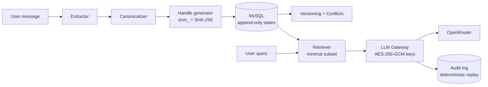

# StateJar 🫙

**Deterministic, minimal-disclosure memory for multi-session conversational AI — no transcripts, no drift, no token burn.**


**Team: Hello World** · Hack4Humanity 2026 · AI for Societal Good Track

> Based on **Indian Patent No. 202621017626** — *Yash Raj, Dr. Amol B. Kasture*

---

## The Problem

- **Context drift** — every new chat session forgets who you are; assistants re-ask what they already knew.
- **Token burn** — the standard fix is replaying entire chat histories to the LLM, paying for thousands of irrelevant tokens per request.
- **Hallucinated memory** — fuzzy vector "memories" retrieve approximately-similar text, not the actual facts, and can't prove what the model was told.

## The Solution

StateJar replaces transcript replay with **content-addressed structured state**:

1. **Extract** — pull structured facts/preferences/constraints from conversation text (rule-based, GLiNER2-ready).
2. **Canonicalize** — normalize to deterministic canonical JSON (₹2,000 ≡ 2000, key order irrelevant, dates → ISO).
3. **Handle** — SHA-256 the canonical form → `shm_…` handle. *Same meaning ⇒ byte-identical handle, every time.*
4. **Retrieve Minimum** — for each query, send the LLM **only the fields it needs**, with a full audit trail proving exactly what was disclosed.

Memory evolves append-only: updates create new handles linked by `parent_handle`; old states are never modified, and conflicting facts are preserved as explicit conflict records instead of silently overwritten.

## Architecture



## The 10 Patent Modules

| # | Module | File | What it does |
|---|--------|------|--------------|
| 1 | State Extraction | `backend/app/memory/extractor.py` | Text → structured state (facts, preferences, constraints, goals, unresolved) |
| 2 | Canonicalization | `backend/app/memory/canonicalizer.py` | Deterministic canonical JSON — wording/order/format invariant |
| 3 | Handle Generation | `backend/app/memory/handle.py` | Content-addressed `shm_` handles via SHA-256 |
| 4 | Deduplicated Storage | `backend/app/memory/storage.py` | INSERT-IGNORE store; identical meaning stored once |
| 5 | No Full Chat Replay | `backend/app/memory/storage.py` | Hard guard: raw transcripts are rejected at write time |
| 6 | Minimal Disclosure Retrieval | `backend/app/memory/retriever.py` | Intent-mapped subset selection + tokens-saved metric |
| 7 | Append-Only Versioning | `backend/app/memory/versioning.py` | Updates create new handles; history immutable |
| 8 | Conflict Preservation | `backend/app/memory/conflict.py` | Contradictions recorded, never silently overwritten |
| 9 | Cross-Session Consistency | `backend/app/memory/routes.py` | New sessions fall back to the user's latest state |
| 10 | Audit + Replay | `backend/app/memory/audit.py` | Every LLM call logged (handle + exact fields sent), deterministically replayable — with secret-scrubbing |

## Live Demo

🔗 **[statejar.com](https://statejar.com)** *(link placeholder — see `docs/deployment.md`)*

### Screenshots

| Landing | Playground (live memory inspector) |
|---|---|
|  |  |

| Minimal retrieval | Handle timeline |
|---|---|
|  |  |

## Local Setup

Prereqs: Python 3.12+, Node 18+, XAMPP (MySQL running).

```bash
# 1. Clone
git clone https://github.com/KING-OF-FLAME/StateJar.git && cd StateJar

# 2. Database — import the schema into XAMPP MySQL
#    (phpMyAdmin → Import → db/migrations/001_init.sql, or:)
mysql -u root < db/migrations/001_init.sql

# 3. Backend
cd backend
pip install -r requirements.txt
copy .env.example .env        # then edit JWT_SECRET / AES_KEY

# 4. Run the API
uvicorn app.main:app --reload --port 8000

# 5. Verify
pytest                         # 65 passed
curl http://localhost:8000/api/v1/health

# 6. Frontend (new terminal)
cd frontend
npm install
npm run dev                    # → http://localhost:5173
```

Sign up → save an OpenRouter key in **API Keys** → open **Playground** → say
*"My name is Ayaan, I prefer email, budget ₹2000"* → start a **new session** → ask *"Book my delivery"* — watch it retrieve only the 3 fields it needs.

## Tech Stack

FastAPI · SQLAlchemy 2.0 · MySQL · Pydantic v2 · bcrypt + JWT · AES-256-GCM (provider keys) · React 18 + Vite · OpenRouter gateway · pytest (65 tests)

## Benchmark

On the demo scenarios, minimal-disclosure retrieval sends **~48–78% fewer tokens** of context than full-state replay (per-request % is computed live and shown in the Playground). Formal benchmark suite lands in Round 2 — *see Roadmap*.

## Roadmap (Round 2)

- **GLiNER2 as primary extractor** (rule-based becomes fallback) for open-domain extraction
- **Benchmark suite** — token savings & consistency vs. transcript-replay and vector-memory baselines
- **Multi-provider gateway** — native OpenAI / Anthropic / Gemini / Ollama alongside OpenRouter
- Audit-log UI, org/team workspaces, handle export API

## License

MIT — see [LICENSE](LICENSE).

---

Built by **Team Hello World** · Yash Raj · Indian Patent No. 202621017626
