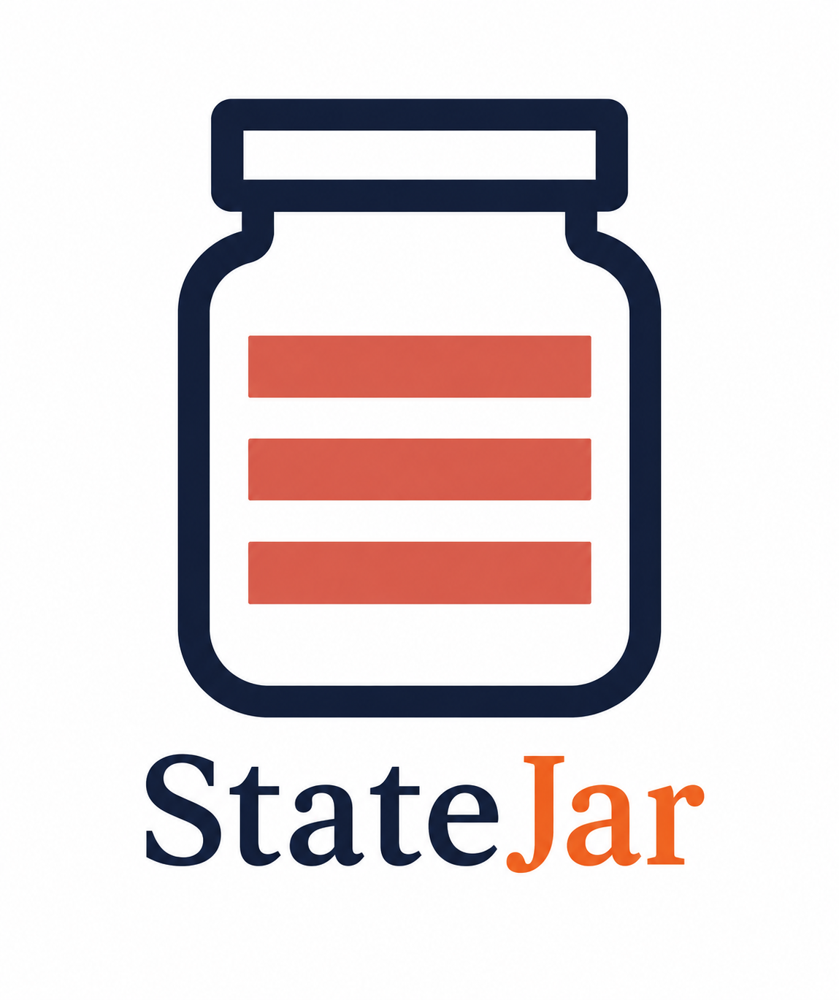
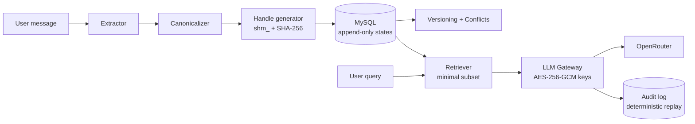
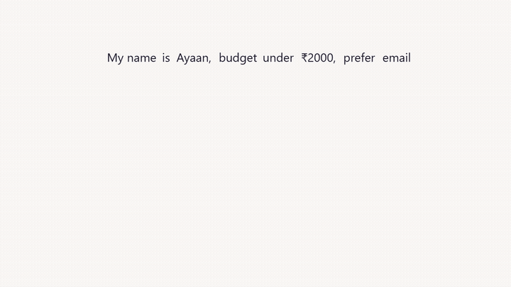
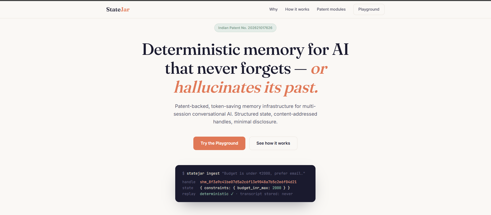
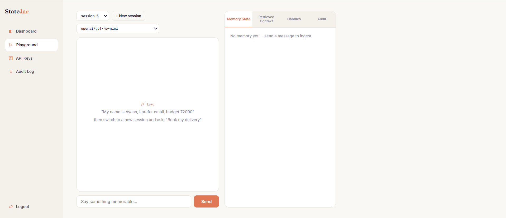
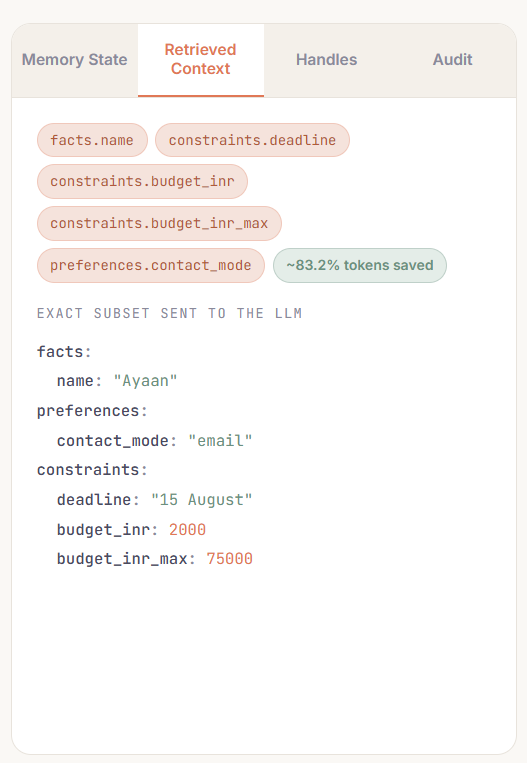
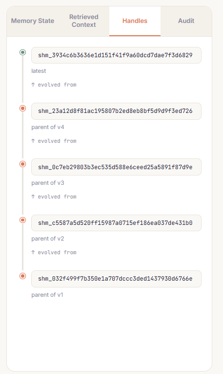
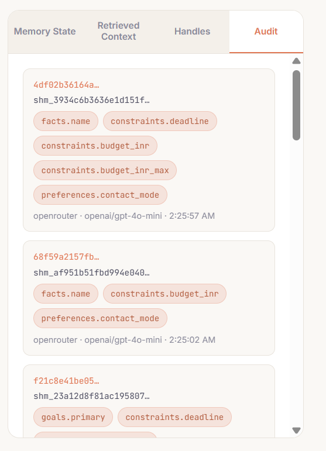
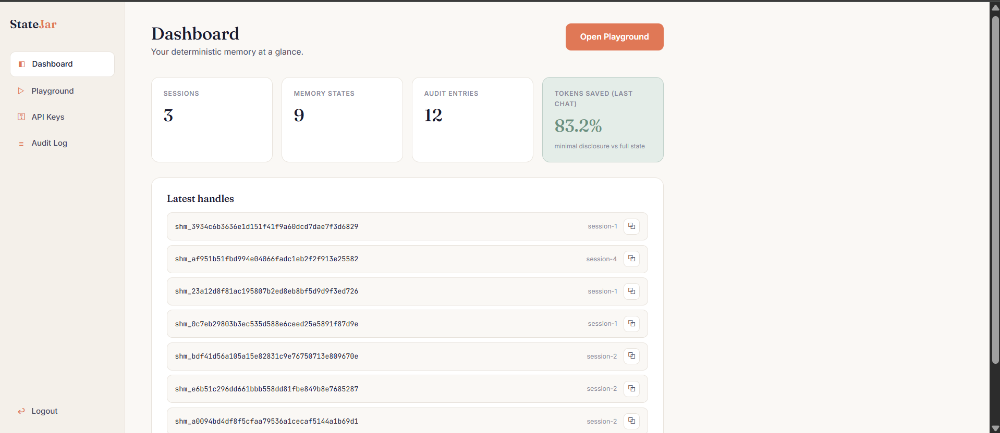

<p align="center"></p>

<h1 align="center">StateJar</h1>

<p align="center"><i>🫙 Deterministic memory for AI -> every fact sealed, indexed, and provable. Nothing replayed, nothing guessed.</i></p>

<p align="center">
  
  
  
  
  
  
</p>

<p align="center">
  <b><a href="https://statejar.com">🔴 Live Demo</a></b> ·
  <a href="#-60-second-brief-for-judges">60-Sec Brief</a> ·
  <a href="#-architecture">Architecture</a> ·
  <a href="#-the-10-patent-modules">10 Modules</a> ·
  <a href="#-local-setup">Run it Locally</a> ·
  <a href="#-roadmap-round-2">Roadmap</a>
</p>

<p align="center">🏆 <b>Team Hello World</b> · Hack4Humanity 2026 · AI for Societal Good</p>

<p align="center"></p>

<table align="center">
  <tr>
    <td align="center"><b>70.7%</b><br><sub>tokens saved (measured)</sub></td>
    <td align="center"><b>10</b><br><sub>patent modules</sub></td>
    <td align="center"><b>205</b><br><sub>tests passing</sub></td>
    <td align="center"><b>SHA-256</b><br><sub>deterministic</sub></td>
  </tr>
</table>

---

## 🫙 60-Second Brief

Most AI systems "remember" you by re-reading your *entire* chat history on every message. StateJar remembers by sealing only the **facts that matter** into a tamper-evident jar, then pouring out only the **exact drops** needed to answer the question in front of it.

| | The Old Way | StateJar |
|---|---|---|
| 📼 **What's stored** | The whole conversation, verbatim | Extracted facts only — name, budget, preference, etc. |
| 🧾 **What reaches the LLM** | The entire chat history, every single time | Only the precise fields the question actually needs |
| 🧭 **Consistency** | Drifts and forgets over long sessions | Deterministic — same fact, same answer, forever |
| 🔍 **Auditability** | A black box — hard to prove what the AI used | Every fact carries a SHA-256 handle + full replay log |
| 💸 **Cost per query** | Grows as the conversation grows | Stays flat, no matter how long the history is |

**See it live:** open the [Playground](https://statejar.com), type *"My name is Ayaan, I prefer email, budget ₹2000"*, start a **new session**, then ask *"Book my delivery"* — watch it pull back exactly 3 fields instead of replaying anything.

**Why it's more than a demo:** this runs on a patent-pending (Indian Patent **202621017626**) 10-module pipeline — extraction → canonicalization → content-addressed sealing → minimal-disclosure retrieval → append-only versioning → full audit replay. Details below. ⬇️

---

## 🕳️ The Problem

Today's conversational AI "remembers" users by shipping the entire prior chat back to the LLM, every single turn. That habit quietly compounds into real costs:

* **High token usage** — the same history gets re-sent again and again
* **Slower responses** — the model wades through text it doesn't need
* **Context window limits** — LLMs can only hold so much at once
* **Memory drift** — facts get forgotten or recalled inconsistently
* **Poor auditability** — near-impossible to prove what the AI actually used

---

## 🫙 Our Solution

StateJar swaps "replay everything" for **sealed, structured memory**.

Instead of storing every word a user says, StateJar extracts only the facts that matter, in a deterministic form — then hands the LLM only what's needed to answer *this* question.

**Example**

Conversation (Session 1):
> "My name is Ayaan, I prefer email, budget ₹2000"

StateJar stores it as structured state and mints a deterministic handle:
`shm_8f3a9c…d21` → `{ facts: {name: "Ayaan"}, preferences: {contact_mode: "email"}, constraints: {budget_inr_max: 2000} }`

Days later, in a brand-new session:
> **"Book my delivery with my usual preferences"**

| Approach | What actually happens | Cost |
|---|---|---|
| Full replay | Re-sends the entire chat history to find the answer | ~350 tokens |
| Vector recall | Retrieves *similar-looking* text — may or may not contain the budget | unpredictable |
| **StateJar** | Reaches into the jar for only the fields it needs: **email · ₹2000 · delivery time (unresolved)** | **~61 tokens** |

*(Token figures measured by the [benchmark suite](backend/benchmarks/results.md) on the booking turn of a 30-turn conversation.)*

The transcript never touches the LLM — it was never even stored.

---

## ⚗️ How StateJar Works

**1. Extract** — Pull the facts that matter out of the conversation: name, preferences, budget, constraints.

**2. Canonicalize** — Fold that information into one standard shape, so identical meaning always produces an identical structure.

**3. Seal** — Generate a unique **SHA-256 handle** for the structured state — a secure, deterministic reference, without ever storing the raw transcript.

**4. Retrieve Minimum** — On a new question, pull back only the fields required to answer it. The LLM sees the relevant slice of truth — never the whole jar.

---

## 📈 Benefits

* **70.7% fewer tokens** — measured, not estimated ([benchmark](backend/benchmarks/results.md))
* **Lower inference cost**
* **Faster response time**
* **Reduced context-window pressure**
* **Consistent, deterministic memory**
* **Minimal information disclosure**
* **Complete, replayable audit trail**
* **Multi-session memory — zero chat replay**
* **Saving Billion Dollars on tokens and contect window limit**

---

## 🧬 Architecture


```mermaid
flowchart LR
    U[User message] --> E[Extractor]
    E --> C[Canonicalizer]
    C --> H["Handle generator\nshm_ + SHA-256"]
    H --> S[(MySQL\nappend-only states)]
    S --> V[Versioning + Conflicts]
    Q[User query] --> R[Retriever\nminimal subset]
    S --> R
    R --> G[LLM Gateway\nAES-256-GCM keys]
    G --> LLM[OpenRouter]
    G --> A[(Audit log\ndeterministic replay)]
```

<br>

---

## 🧩 The 10 Patent Modules

| # | Module | File | What it does |
|---|--------|------|--------------|
| 1 | State Extraction | `backend/app/memory/extractor.py` | Text → structured state |
| 2 | Canonicalization | `backend/app/memory/canonicalizer.py` | Deterministic canonical JSON |
| 3 | Handle Generation | `backend/app/memory/handle.py` | Content-addressed `shm_` SHA-256 handles |
| 4 | Deduplicated Storage | `backend/app/memory/storage.py` | Identical meaning stored once |
| 5 | No Full Chat Replay | `backend/app/memory/storage.py` | Raw transcripts rejected at write time |
| 6 | Minimal Disclosure Retrieval | `backend/app/memory/retriever.py` | Sends only the fields needed |
| 7 | Append-Only Versioning | `backend/app/memory/versioning.py` | Updates create new handles; history immutable |
| 8 | Conflict Preservation | `backend/app/memory/conflict.py` | Contradictions recorded, never overwritten |
| 9 | Cross-Session Consistency | `backend/app/memory/routes.py` | New sessions use latest state |
| 10 | Audit + Replay | `backend/app/memory/audit.py` | Every LLM call logged, replayable |

<br>

---

## 🎞️ Module Animations

<table>
  <tr>
    <td width="50%"><b>M1 — Structured Memory Capture</b><br></td>
    <td width="50%"><b>M2 — Deterministic Canonicalization</b><br></td>
  </tr>
  <tr>
    <td width="50%"><b>M3 — Content-Addressed Handles</b><br></td>
    <td width="50%"><b>M4 — Deduplicated Storage</b><br></td>
  </tr>
  <tr>
    <td width="50%"><b>M5 — No Full Chat Replay</b><br></td>
    <td width="50%"><b>M6 — Minimum-Sufficient Retrieval</b><br></td>
  </tr>
  <tr>
    <td width="50%"><b>M7 — Append-Only Versioning</b><br></td>
    <td width="50%"><b>M8 — Conflict Preservation</b><br></td>
  </tr>
  <tr>
    <td width="50%"><b>M9 — Cross-Session Consistency</b><br></td>
    <td width="50%"><b>M10 — Audit Trail + Deterministic Replay</b><br></td>
  </tr>
</table>

<br>

---

## 🌐 Live Demo

🔗 **[statejar.com](https://statejar.com)** — deployed on Vercel + Railway

### 🖼️ Screenshots

<table>
  <tr>
    <td width="50%"><b>Landing</b><br></td>
    <td width="50%"><b>Playground — live memory inspector</b><br></td>
  </tr>
  <tr>
    <td width="50%"><b>Minimal retrieval (2 of 14 fields sent — live per-request % in the Playground)</b><br></td>
    <td width="50%"><b>Handle timeline — append-only versioning</b><br></td>
  </tr>
  <tr>
    <td width="50%"><b>Audit trail — provable provenance</b><br></td>
    <td width="50%"><b>Dashboard</b><br></td>
  </tr>
</table>

<br>

---

## 🧰 Tech Stack

- FastAPI
- SQLAlchemy 2.0
- MySQL
- Pydantic v2
- bcrypt + JWT Authentication
- AES-256-GCM Encryption
- React 18 + Vite
- OpenRouter Gateway
- pytest (205 tests)

## Benchmark

Measured by [`backend/benchmarks/benchmark.py`](backend/benchmarks/benchmark.py) — a scripted 30-turn, 3-session conversation through the real memory core (no LLM calls, tiktoken `cl100k_base`, offline):

| Metric | Full replay | StateJar |
|---|---|---|
| Total tokens sent (30 turns) | 5,808 | **1,699 (−70.7%)** |
| Mean context per turn | 193.6 tokens | **56.6 tokens** |
| Cost for the run (gpt-4o-mini input rate) | $0.000871 | **$0.000255 (−70.7%)** |
| Determinism (100 shuffled-key canonicalize+hash runs) | — | **1/100 unique handle ✅** |
| Repeated query returns an identical subset | — | **yes ✅** |
| Median canonicalize+hash latency | — | **~1.8 ms** |

Full report with per-turn CSV: [`backend/benchmarks/results.md`](backend/benchmarks/results.md). Run it yourself: `python benchmarks/benchmark.py`.

## 📚 Documentation

| Document | What's in it |
|---|---|
| [`docs/api.md`](docs/api.md) | **Developer API quickstart** — generate an `sj_live_…` key, then ingest / query / chat with three copy-paste `curl` calls. Also readable in-app under **API Docs**. |
| [`SECURITY.md`](SECURITY.md) | **Threat model** — 18 threats mapped to their mitigation and the test that enforces each, plus the honest limitations. |
| [`scripts/check-secrets.sh`](scripts/check-secrets.sh) | Pre-commit guard that refuses credential-shaped strings. Enable it once: `ln -sf ../../scripts/check-secrets.sh .git/hooks/pre-commit` — then `./scripts/check-secrets.sh --all` audits everything already tracked. |
| [`docs/deployment.md`](docs/deployment.md) | Deploying the stack: Railway (API + MySQL) and Vercel (frontend), with the custom domain. |
| [`backend/benchmarks/results.md`](backend/benchmarks/results.md) | Full benchmark report, per-turn CSV included. |

The public API base is **`https://api.statejar.com`**. The original
`https://statejar-production.up.railway.app` points at the same service and
still works, so existing integrations keep running.

`GET /api/v1/health` returns the commit each instance is running, so a deployed
build can be checked against `main` without guessing:

```bash
curl https://api.statejar.com/api/v1/health
# {"status":"ok","version":"25e7afb"}
```

<br>

---

## 🛠️ Local Setup

<details>
<summary><b>🛠️ Local Setup (click to expand)</b></summary>

Prereqs: Python 3.12+, Node 18+, XAMPP (MySQL running).

```bash
# 1. Clone
git clone https://github.com/KING-OF-FLAME/StateJar.git && cd StateJar

# 2. Database — import the schema into XAMPP MySQL
#    (phpMyAdmin → Import → db/migrations/001_init.sql, or:)
mysql -u root < db/migrations/001_init.sql

# 3. Backend
cd backend
pip install -r requirements.txt
copy .env.example .env        # then edit JWT_SECRET / AES_KEY

# 4. Run the API
uvicorn app.main:app --reload --port 8000

# 5. Verify
pytest                         # 80 passed
curl http://localhost:8000/api/v1/health

# 6. Frontend (new terminal)
cd frontend
npm install
npm run dev                    # → http://localhost:5173
```

Sign up → save a key for any provider (OpenRouter, OpenAI, Anthropic, Gemini,
or point at a local Ollama) in **API Keys** → open **Playground** → say
*"Stack: React + Tailwind. Dark theme, brand color #E07856."* → start a
**new session** → ask *"Now add a pricing section."* — watch it retrieve only
the fields it needs.

</details>

<br>

---

## 🧭 Roadmap (Round 2)

- ✅ **Multi-provider gateway** — *shipped.* Native OpenAI, Anthropic, Gemini and
  Ollama alongside OpenRouter. Save a key per provider on **API Keys**; each
  provider's live catalog is fetched with your own key and grouped in the model
  picker, and any custom model id passes through unwhitelisted.
- ✅ **Benchmark suite** — *shipped.* See [Benchmark](#benchmark).
- ✅ **Audit-log UI** — *shipped.* Provenance timeline with per-entry replay.
- **GLiNER as primary extractor** (rule-based becomes fallback) for open-domain
  extraction — env-gated today via `EXTRACTOR_MODE`
- Org/team workspaces, handle export API

## 📄 License

Proprietary · All Rights Reserved · Indian Patent 202621017626. Shared for Hack4Humanity 2026 evaluation. See [LICENSE](LICENSE).

<br>

---

<p align="center"></p>

<p align="center"><sub>Indian Patent No. 202621017626</sub></p>

<p align="center">Built with ❤️ by <b>Team Hello World</b> — Yash Raj, Dhruv Devaliya, Lakshay Vig, Tarak Dhone</p>

<p align="center">
  <a href="https://statejar.com">Demo</a> ·
  <a href="https://github.com/KING-OF-FLAME/StateJar/issues">GitHub Issues</a> ·
  <a href="LICENSE">License</a>
</p>
