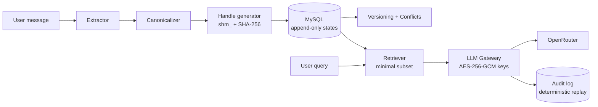

<p align="center"></p>

<h1 align="center">StateJar</h1>

<p align="center"><i>🫙 Deterministic memory for AI -> every fact sealed, indexed, and provable. Nothing replayed, nothing guessed.</i></p>

<p align="center">
  
  
  
  
  
  
</p>

<p align="center">
  <b><a href="https://statejar.com">🔴 Live Demo</a></b> ·
  <a href="#-60-second-brief-for-judges">60-Sec Brief</a> ·
  <a href="#-architecture">Architecture</a> ·
  <a href="#-the-10-patent-modules">10 Modules</a> ·
  <a href="#-local-setup">Run it Locally</a> ·
  <a href="#-roadmap-round-2">Roadmap</a>
</p>

<p align="center">🏆 <b>Team Hello World</b> · Hack4Humanity 2026 · AI for Societal Good</p>

<p align="center"></p>

<table align="center">
  <tr>
    <td align="center"><b>10</b><br><sub>patent modules</sub></td>
    <td align="center"><b>704</b><br><sub>tests passing</sub></td>
    <td align="center"><b>SHA-256</b><br><sub>content-addressed</sub></td>
    <td align="center"><b>0</b><br><sub>transcripts stored</sub></td>
  </tr>
</table>

<p align="center">
  <b>▶ <a href="https://www.youtube.com/watch?v=3Ehd88D9xsw">Watch the demo video</a></b>
  &nbsp;·&nbsp; <a href="https://statejar.com">Try it live at statejar.com</a>
</p>

<p align="center"><sub>Indian Utility Patent <b>202621017626</b> — “Deterministic State-Handle
Based Memory for Multi-Session Conversational System”</sub></p>

---

## 🫙 60-Second Brief

Most AI systems "remember" you by re-reading your *entire* chat history on every message. StateJar remembers by sealing only the **facts that matter** into a tamper-evident jar, then pouring out only the **exact drops** needed to answer the question in front of it.

| | The Old Way | StateJar |
|---|---|---|
| 📼 **What's stored** | The whole conversation, verbatim | Extracted facts only — name, budget, preference, etc. |
| 🧾 **What reaches the LLM** | The entire chat history, every single time | Only the precise fields the question actually needs |
| 🧭 **Consistency** | Drifts and forgets over long sessions | Deterministic — same fact, same answer, forever |
| 🔍 **Auditability** | A black box — hard to prove what the AI used | Every fact carries a SHA-256 handle + full replay log |
| 💸 **Cost per query** | Grows with every turn, without bound | Grows with the *state*, not the transcript — see [Benchmark](#benchmark) for where the crossover actually sits |

**See it live:** open the [Playground](https://statejar.com), type *"My name is Ayaan, I prefer email, budget ₹2000"*, start a **new session**, then ask *"Book my delivery"* — watch it pull back exactly 3 fields instead of replaying anything.

**Why it's more than a demo:** this runs on a patent-pending (Indian Patent **202621017626**) 10-module pipeline — extraction → canonicalization → content-addressed sealing → minimal-disclosure retrieval → append-only versioning → full audit replay. Details below. ⬇️

---

## 🧷 What StateJar actually guarantees

A memory layer for conversational AI. Three claims, each phrased as what you can
watch it do in the Playground in under a minute.

**1 · It refuses to guess.** A value passes type validation before it enters
state. `max load per container is 24 tonnes` classifies as a quantity, and a
money field will not take a quantity — so it is *declined*, not coerced into a
budget of twenty-four rupees. Every decline is recorded with a reason and shown
in the Memory State panel.

**2 · One field, one value.** A `(slot, qualifier)` uniqueness invariant is
asserted at the STORE boundary, so two values for one concept cannot both be
current. When you change your mind the old value moves to history and is never
sent to the model.

**3 · The handle is portable and verifiable.** State is content-addressed:
serialise it canonically, hash it, and the same bytes always produce the same
handle. Restoring one re-derives the handle and refuses if they disagree — so a
restore that succeeds is a verification. Handles cross sessions and model
vendors, because state is data rather than a feature of somebody's product.

### The pipeline

```
INGEST → EXTRACT → CANONICALIZE → HANDLE → STORE → RETRIEVE → AUDIT
```

Extraction runs **before** canonicalization. That order is the argument: a
probabilistic tier can only ever *propose*, and the deterministic layer decides.
It is why a language model in the pipeline does not make the pipeline
probabilistic.

### What runs in production, precisely

Deployed extraction is **rules only**. GLiNER2 (tier 2) needs `gliner` and
`torch`, which live in `requirements-ml.txt` and are deliberately **not**
installed on Railway — production builds stay small. Tier 3 (LLM extraction) is
off by default behind `EXTRACTOR_LLM_FALLBACK`, needs a provider key on the
calling account, and **has never run in production**. The tier chips in the
Playground show which tiers actually ran on each turn, including the ones that
were attempted and failed.

Known gaps are written down rather than hidden: see
[`docs/known-issues.md`](docs/known-issues.md).

---

## 🕳️ The Problem

Today's conversational AI "remembers" users by shipping the entire prior chat back to the LLM, every single turn. That habit quietly compounds into real costs:

* **High token usage** — the same history gets re-sent again and again
* **Slower responses** — the model wades through text it doesn't need
* **Context window limits** — LLMs can only hold so much at once
* **Memory drift** — facts get forgotten or recalled inconsistently
* **Poor auditability** — near-impossible to prove what the AI actually used

---

## 🫙 Our Solution

StateJar swaps "replay everything" for **sealed, structured memory**.

Instead of storing every word a user says, StateJar extracts only the facts that matter, in a deterministic form — then hands the LLM only what's needed to answer *this* question.

**Example**

Conversation (Session 1):
> "My name is Ayaan, I prefer email, budget ₹2000"

StateJar stores it as structured state and mints a deterministic handle:
`shm_8f3a9c…d21` → `{ facts: {name: "Ayaan"}, preferences: {contact_mode: "email"}, constraints: {budget_inr_max: 2000} }`

Days later, in a brand-new session:
> **"Book my delivery with my usual preferences"**

| Approach | What actually happens | Cost |
|---|---|---|
| Full replay | Re-sends the entire chat history to find the answer | 416 tokens |
| Vector recall | Retrieves *similar-looking* text — may or may not contain the budget | unpredictable |
| **StateJar** | Reaches into the jar for only the field the question names | **179 tokens (−57%)** |

*(Turn 36 of the `relief-40-mixed` run, measured 2026-08-06 — see
[Benchmark](#benchmark). Earlier turns are **negative**: the fixed instruction
block costs more than a short transcript. The Benchmark section gives the
whole-conversation figure and the crossover rather than this turn alone.)*

The transcript never touches the LLM — it was never even stored.

---

## ⚗️ How StateJar Works

**1. Extract** — Pull the facts that matter out of the conversation: name, preferences, budget, constraints.

**2. Canonicalize** — Fold that information into one standard shape, so identical meaning always produces an identical structure.

**3. Seal** — Generate a unique **SHA-256 handle** for the structured state — a secure, deterministic reference, without ever storing the raw transcript.

**4. Retrieve Minimum** — On a new question, pull back only the fields required to answer it. The LLM sees the relevant slice of truth — never the whole jar.

---

## 📈 Benefits

* **Fewer tokens on long conversations** — and *more* on short ones. The 17-turn demo never crosses over at all (−136.8% over the run); the 40-turn one crosses at turn 28 and is −9.1% over the whole run. The [Benchmark](#benchmark) section states both, with their baselines, rather than quoting the flattering one.
* **Lower inference cost**
* **Faster response time**
* **Reduced context-window pressure**
* **Consistent, deterministic memory**
* **Minimal information disclosure**
* **Complete, replayable audit trail**
* **Multi-session memory — zero chat replay**
* **Saving Billion Dollars on tokens and contect window limit**

---

## 🧬 Architecture


```mermaid
flowchart LR
    U[User message] --> E[Extractor]
    E --> C[Canonicalizer]
    C --> H["Handle generator\nshm_ + SHA-256"]
    H --> S[(MySQL\nappend-only states)]
    S --> V[Versioning + Conflicts]
    Q[User query] --> R[Retriever\nminimal subset]
    S --> R
    R --> G[LLM Gateway\nAES-256-GCM keys]
    G --> LLM[OpenRouter]
    G --> A[(Audit log\ndeterministic replay)]
```

<br>

---

## 🧩 The 10 Patent Modules

| # | Module | File | What it does |
|---|--------|------|--------------|
| 1 | State Extraction | `backend/app/memory/extractor.py` | Text → structured state |
| 2 | Canonicalization | `backend/app/memory/canonicalizer.py` | Deterministic canonical JSON |
| 3 | Handle Generation | `backend/app/memory/handle.py` | Content-addressed `shm_` SHA-256 handles |
| 4 | Deduplicated Storage | `backend/app/memory/storage.py` | Identical meaning stored once |
| 5 | No Full Chat Replay | `backend/app/memory/storage.py` | Raw transcripts rejected at write time |
| 6 | Minimal Disclosure Retrieval | `backend/app/memory/retriever.py` | Sends only the fields needed |
| 7 | Append-Only Versioning | `backend/app/memory/versioning.py` | Updates create new handles; history immutable |
| 8 | Conflict Preservation | `backend/app/memory/conflict.py` | Contradictions recorded, never overwritten |
| 9 | Cross-Session Consistency | `backend/app/memory/routes.py` | New sessions use latest state |
| 10 | Audit + Replay | `backend/app/memory/audit.py` | Every LLM call logged, replayable |

<br>

---

## 🎞️ Module Animations

<table>
  <tr>
    <td width="50%"><b>M1 — Structured Memory Capture</b><br></td>
    <td width="50%"><b>M2 — Deterministic Canonicalization</b><br></td>
  </tr>
  <tr>
    <td width="50%"><b>M3 — Content-Addressed Handles</b><br></td>
    <td width="50%"><b>M4 — Deduplicated Storage</b><br></td>
  </tr>
  <tr>
    <td width="50%"><b>M5 — No Full Chat Replay</b><br></td>
    <td width="50%"><b>M6 — Minimum-Sufficient Retrieval</b><br></td>
  </tr>
  <tr>
    <td width="50%"><b>M7 — Append-Only Versioning</b><br></td>
    <td width="50%"><b>M8 — Conflict Preservation</b><br></td>
  </tr>
  <tr>
    <td width="50%"><b>M9 — Cross-Session Consistency</b><br></td>
    <td width="50%"><b>M10 — Audit Trail + Deterministic Replay</b><br></td>
  </tr>
</table>

<br>

---

## 🌐 Live Demo

🔗 **[statejar.com](https://statejar.com)** — deployed on Vercel + Railway

### 🖼️ Screenshots

<table>
  <tr>
    <td width="50%"><b>Landing</b><br></td>
    <td width="50%"><b>Playground — live memory inspector</b><br></td>
  </tr>
  <tr>
    <td width="50%"><b>Minimal retrieval (2 of 14 fields sent — live per-request % in the Playground)</b><br></td>
    <td width="50%"><b>Handle timeline — append-only versioning</b><br></td>
  </tr>
  <tr>
    <td width="50%"><b>Audit trail — provable provenance</b><br></td>
    <td width="50%"><b>Dashboard</b><br></td>
  </tr>
</table>

<br>

---

## 🧰 Tech Stack

- FastAPI
- SQLAlchemy 2.0
- MySQL
- Pydantic v2
- bcrypt + JWT Authentication
- AES-256-GCM Encryption
- React 18 + Vite + react-router-dom (not Next.js)
- OpenRouter gateway, plus native OpenAI / Anthropic / Gemini / Ollama
- pytest — **704 passing, 1 skipped**

Deployed as FastAPI + MySQL on **Railway**, static frontend on **Vercel**.

## Benchmark

**Methodology, in two sentences.** The baseline is a full-transcript replay:
every prior turn re-sent on every request, which is what a memoryless client
does. StateJar's figure is the system context it actually sends plus the
current message, and the saving is `1 - sent / replayed` — counted with
tiktoken `cl100k_base`, no LLM calls, offline and reproducible.

### The per-conversation figures — measured 2026-08-06

These are the numbers. Everything below is derived from them.

| Demo | Turns | Replay total | StateJar total | Whole-conversation | Crossover |
|---|---:|---:|---:|---:|---:|
| relief-17 (the in-app demo) | 17 | 2,169 | 5,137 | **−136.8%** | never |
| relief-40-mixed | 40 | 9,874 | 10,777 | **−9.1%** | **turn 28** |

**Both are negative over the whole conversation, and we publish them that way.**
StateJar pays a fixed ~158-token instruction block on every turn before it
sends a single fact — 50% of everything it sends across the 40-turn run — and a
short conversation never earns that back. A replay of three short turns is
genuinely cheaper than a state plus its scaffolding, and hiding that would be
the easiest thing in this repository to catch.

*Crossover* is the first turn from which the per-turn saving stays positive to
the end. After it, on relief-40-mixed:

| Turns 28–40 | Replay | StateJar | Saved |
|---|---:|---:|---:|
| Marginal rate once state stops growing | 5,113 | 2,613 | **48.9%** |
| Final turn (40) | 467 | 224 | **52.0%** |

That is the number that describes a conversation which keeps going, and it is a
*marginal* rate for turns 28–40 — not the whole-conversation figure, which is
−9.1%.

### Per turn

relief-17 — selective retrieval never engages; state stays under the threshold
the whole way:

| Turn | Replay | Sent | Saved | Fields | Mode |
|---:|---:|---:|---:|---:|---|
| 1 | 19 | 192 | −910.5% | 1 | `full_state` |
| 5 | 78 | 274 | −251.3% | 8 | `full_state` |
| 9 | 128 | 310 | −142.2% | 12 | `full_state` |
| 13 | 183 | 331 | −80.9% | 14 | `full_state` |
| 17 | 226 | 366 | −61.9% | 17 | `full_state` |

relief-40-mixed — 16 facts, 14 questions, 8 revisions, 2 retractions. Selection
engages at turn 28, when the state finally passes the threshold:

| Turn | Replay | Sent | Saved | Fields | Mode |
|---:|---:|---:|---:|---:|---|
| 1 | 19 | 192 | −910.5% | 1 | `full_state` |
| 8 | 118 | 292 | −147.5% | 10 | `full_state` |
| 16 | 200 | 326 | −63.0% | 13 | `full_state` |
| 24 | 289 | 367 | −27.0% | 17 | `full_state` |
| **28** | 325 | 213 | **+34.5%** | 5 | `field_match` |
| 32 | 369 | 203 | +45.0% | 2 | `intent_map` |
| 36 | 416 | 179 | +57.0% | 1 | `field_match` |
| 40 | 467 | 224 | +52.0% | 5 | `field_match` |

Full 40-row tables and the CSV: [`backend/benchmarks/results.md`](backend/benchmarks/results.md).
Run it yourself: `python benchmarks/benchmark.py`.

### Cumulative illustration — an extrapolation, not a measurement

Multiplying the measured per-conversation figure by a conversation count. It is
arithmetic on the number above, not a second measurement, and it cannot be
better than that number:

> **N = 1,000 conversations of exactly the relief-40-mixed shape.**
> At the measured −9.1%, StateJar sends **10,777,000** tokens where a replay
> sends **9,874,000** — **903,000 tokens *more*, not fewer.**

The whole-conversation figure is negative, so the aggregate is negative too.
That is what honest extrapolation looks like when the per-conversation number
has not crossed over. If the conversations run past turn 28, the marginal 48.9%
applies only to the turns after it — never to the whole run.

**Never quote an aggregate without the per-conversation figure beside it.**

### Determinism

| Check | Result |
|---|---|
| 100 canonicalize+hash runs, shuffled key order | **1/100 unique handle ✅** |
| Repeated query returns a byte-identical subset | **yes ✅** |
| Same conversation, separate processes, same handle | **yes ✅** |
| Median canonicalize+hash latency (19-field state) | ~17 ms |

There is **no accuracy benchmark**. No labelled evaluation set exists for this
project, so no extraction-accuracy figure appears anywhere in this README — and
any such number you see quoted about StateJar, including from us, is unmeasured.

Token savings is **not** the headline benefit. The headline is that the memory
is deterministic, inspectable, and refuses to guess. Savings are a consequence,
and a conversation-length-dependent one.

## 📚 Documentation

| Document | What's in it |
|---|---|
| [`docs/api.md`](docs/api.md) | **Developer API quickstart** — generate an `sj_live_…` key, then ingest / query / chat with three copy-paste `curl` calls. Also readable in-app under **API Docs**. |
| [`SECURITY.md`](SECURITY.md) | **Threat model** — 18 threats mapped to their mitigation and the test that enforces each, plus the honest limitations. |
| [`scripts/check-secrets.sh`](scripts/check-secrets.sh) | Pre-commit guard that refuses credential-shaped strings. Enable it once: `ln -sf ../../scripts/check-secrets.sh .git/hooks/pre-commit` — then `./scripts/check-secrets.sh --all` audits everything already tracked. |
| [`docs/deployment.md`](docs/deployment.md) | Deploying the stack: Railway (API + MySQL) and Vercel (frontend), with the custom domain. |
| [`backend/benchmarks/results.md`](backend/benchmarks/results.md) | Full benchmark report, per-turn CSV included. |
| [`docs/known-issues.md`](docs/known-issues.md) | **Known issues** — behaviour that is wrong, understood, and not yet fixed, with what a fix would have to touch. Read this before trusting a number StateJar gives you. |

The public API base is **`https://api.statejar.com`**. The original
`https://statejar-production.up.railway.app` points at the same service and
still works, so existing integrations keep running.

`GET /api/v1/health` returns the commit each instance is running, so a deployed
build can be checked against `main` without guessing:

```bash
curl https://api.statejar.com/api/v1/health
# {"status":"ok","version":"25e7afb"}
```

<br>

---

## 🛠️ Local Setup

<details>
<summary><b>🛠️ Local Setup (click to expand)</b></summary>

Prereqs: Python 3.12+, Node 18+, and MySQL 8 running (XAMPP is fine).

```bash
# 1. Clone
git clone https://github.com/KING-OF-FLAME/StateJar.git && cd StateJar

# 2. Database — apply migrations in numeric order.
#    001 creates the schema; the rest are additive.
mysql -u root < db/migrations/001_init.sql
for f in db/migrations/0*.sql; do mysql -u root statejar < "$f"; done

# 3. Backend
cd backend
pip install -r requirements.txt
cp .env.example .env          # Windows: copy .env.example .env
#    Then set JWT_SECRET and AES_KEY to real random values. AES_KEY must be
#    exactly 32 bytes. Never commit .env — it is gitignored, .env.example is not.
python -c "import secrets; print(secrets.token_urlsafe(48))"

# 4. Run the API
uvicorn app.main:app --reload --port 8000

# 5. Verify. The suite does NOT need MySQL — override the DB so each
#    TestClient does not pay a connection timeout (10 min -> ~100 s).
DB_URL="sqlite:///:memory:" EXTRACTOR_MODE=rules pytest -q
#    -> 704 passed, 1 skipped
curl http://localhost:8000/api/v1/health

# 6. Frontend (new terminal)
cd frontend
npm install
npm run dev                    # → http://localhost:5173
```

The app also boots without any provider key: `/memory/ingest` runs the whole
memory pipeline locally, so the Playground panels, handles and audit trail all
work before you have configured a model. A key is only needed for a model's
*reply*.

Every environment variable is documented in
[`backend/.env.example`](backend/.env.example) — placeholders only, never real
values — and explained in the in-app **Help** centre under *Settings*.

Sign up → save a key for any provider (OpenRouter, OpenAI, Anthropic, Gemini,
or point at a local Ollama) in **API Keys** → open **Playground** → say
*"Stack: React + Tailwind. Dark theme, brand color #E07856."* → start a
**new session** → ask *"Now add a pricing section."* — watch it retrieve only
the fields it needs.

</details>

<br>

---

## 🧭 Round 2 status

Built by opening the code for each item, not from a plan. **Shipped** means
implemented, reachable from the UI or API, and covered by a test — all three.
Anything short of that is Partial or Not started, with what is missing named.

The reachability bar is there for a reason: `/profile` shipped working, tested,
and unreachable — no link anywhere in the console pointed at it — and 700 green
tests said nothing, because none of them asked how a user gets there. There is
now a test that does (`backend/tests/test_nav_coverage.py`).

| Item | Status | Evidence / what is missing |
|---|---|---|
| **Multi-provider gateway** | ✅ Shipped | 6 providers in `KEYED_PROVIDERS`; cards on **API Keys**; live catalog via `GET /models`; `POST /keys/provider/{p}/test`. Exercised in-browser. |
| **Audit-log UI** | ✅ Shipped | `/audit` route + `AuditTimeline.jsx`; `GET /audit/{request_id}/replay` re-derives the handle and reports `verified`. |
| **Benchmark suite** | ✅ Shipped | `backend/benchmarks/benchmark.py`, with `results.md` and per-turn CSV. Measures tokens and latency — **not** accuracy. |
| **User profile** | ✅ Shipped | `GET`/`PATCH /api/v1/profile`, migration `007`, 19 tests incl. cross-user isolation. Reachable from the sidebar and the account menu. |
| **Chat retention + turn provenance** | ✅ Shipped | Transcript client-side only; `GET /sessions/{tag}/turns` returns provenance with `contains_message_text: false`. |
| **GLiNER2 (tier 2) in production** | ⚠️ Partial | Code ships and is env-gated by `EXTRACTOR_MODE`, but `gliner`/`torch` live in `requirements-ml.txt` and are **deliberately not installed on Railway**. Deployed extraction is **rules only**. |
| **Tier 3 (LLM extraction) in production** | ⚠️ Partial | Implemented, tested, gated behind `EXTRACTOR_LLM_FALLBACK` (default off) plus a provider key on the calling account. **Has never run on the deployed instance.** |
| **Scope chaining (namespace → user → session)** | ❌ Not started | No `app/memory/scope.py`; no `end_user_id` or `namespace_id` anywhere in `backend/app/`; no migration past `007`. Memory is session-scoped, and crossing a session still means pasting a handle. |
| **The eight Round 2 API endpoints** | ❌ Not started | `POST /memory/recall`, `GET`/`PATCH /memory/state`, `GET /handles/{handle}`, `POST /handles/restore`, `GET`/`POST /sessions`, `GET /memory/declined` — none exist. `POST /memory/ingest` still takes only `session_tag` and `text`; `GET /audit` takes no scope parameter. |
| **`extraction: "async"`** | ❌ Not started | No `BackgroundTasks` usage anywhere in `backend/app/`. |
| **Extraction settings UI** | ❌ Not started | Zero references to `EXTRACTOR_MODE` or `EXTRACTOR_LLM_*` in `frontend/src/` outside the help text. The tiers are configured by environment variable only. |
| **Labelled eval harness** | ❌ Not started | `backend/tests/golden/` holds 48 cases, but it is a **regression corpus, not an eval set**: it asserts exact paths and values and produces no score. No precision, recall or F1 is computed anywhere, which is why no accuracy figure appears in this README. |
| **Org / team workspaces, handle export API** | ❌ Not started | No code. |

### Next, in the order it would be built

1. **Scope chaining** — `end_user_id` on `memory_states` and `audit_logs`, a
   `Scope` resolver, and the unique constraint widened to
   `(handle, user_id, end_user_id, session_tag)`. Everything else on this list
   depends on it, because without a user scope the endpoints below have nothing
   to address.
2. **The Round 2 endpoints**, once there is a scope for them to take.
3. **Labelled eval harness** — the one item that would let this README quote an
   accuracy number. Until it exists, it will not.
4. Extraction settings UI · org/team workspaces · handle export API.

## 📄 License

Proprietary · All Rights Reserved · Indian Patent 202621017626. Shared for Hack4Humanity 2026 evaluation. See [LICENSE](LICENSE).

<br>

---

<p align="center"></p>

<p align="center"><sub>Indian Patent No. 202621017626</sub></p>

<p align="center">Built with ❤️ by <b>Team Hello World</b> — Yash Raj, Dhruv Devaliya, Tarak Dhone, Lakshay Vig</p>

<p align="center">
  <a href="https://statejar.com">Demo</a> ·
  <a href="https://github.com/KING-OF-FLAME/StateJar/issues">GitHub Issues</a> ·
  <a href="LICENSE">License</a>
</p>
